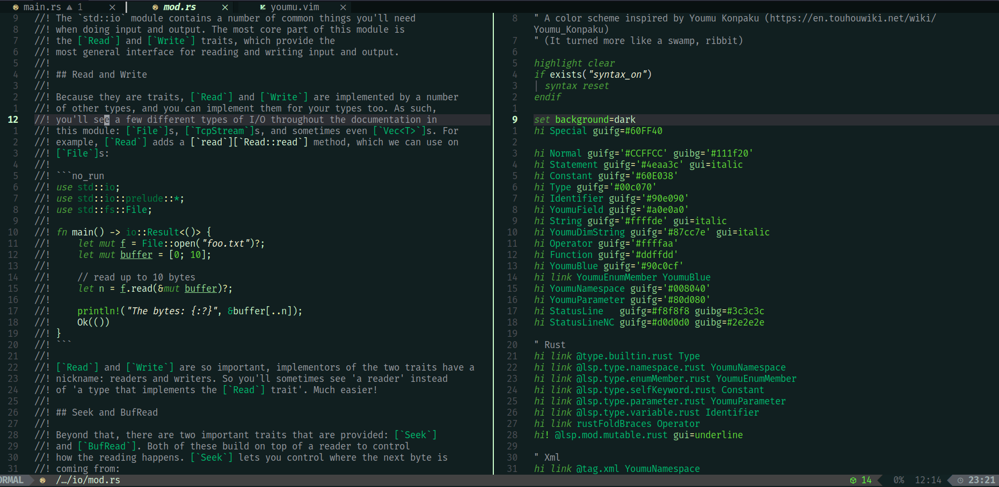

# Youmu Konpaku Inspired

This is a colorscheme for nvim is inspired by [Youmu Konpaku](https://en.touhouwiki.net/wiki/Youmu_Konpaku) from Touhou games by ZUN.
(Though it looks like a swamp, ribbit)

Besides general colors, it overwrites LSP tokens for rust, and some other languages that I sometimes use or read.

# Installation

* Copy youmu.vim into ~/.config/nvim/colors/
* `:colorscheme youmu` 

For persistent change you can add it to `$MYVIMRC`;

```lua
vim.cmd([[
:colorscheme youmu
]])
```

* Ribbit

# Example



This is `std::io` from rust and the colorscheme file itself.
